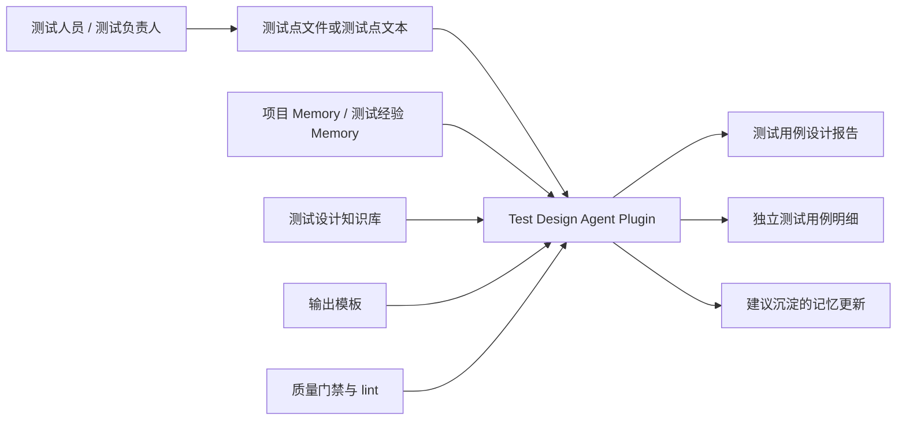
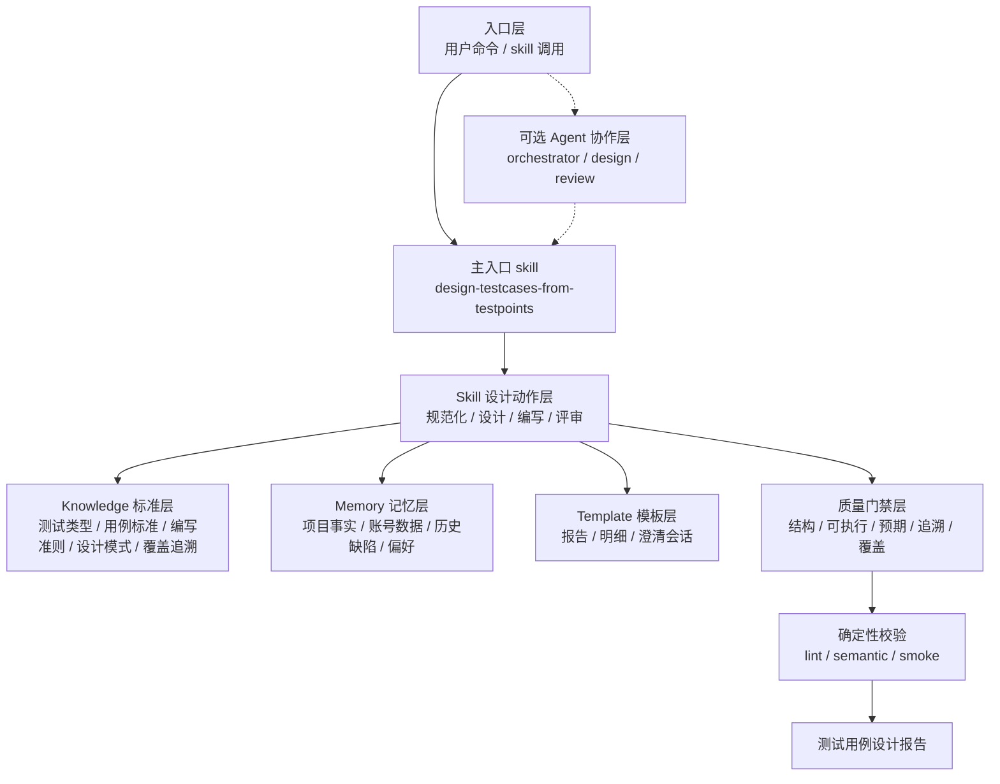
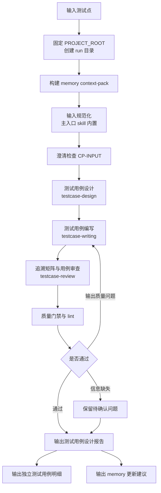
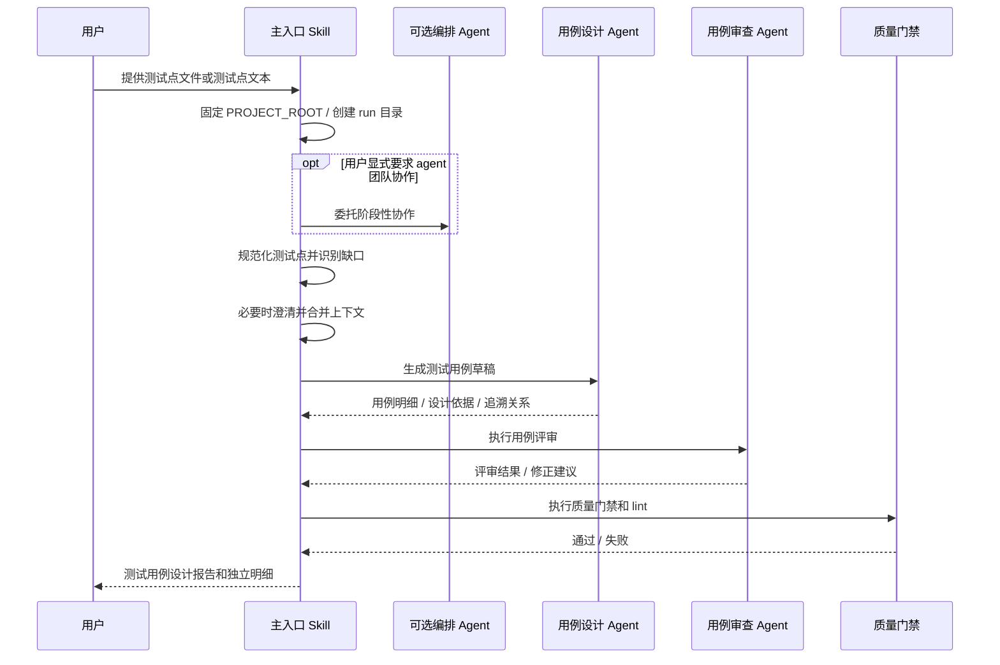
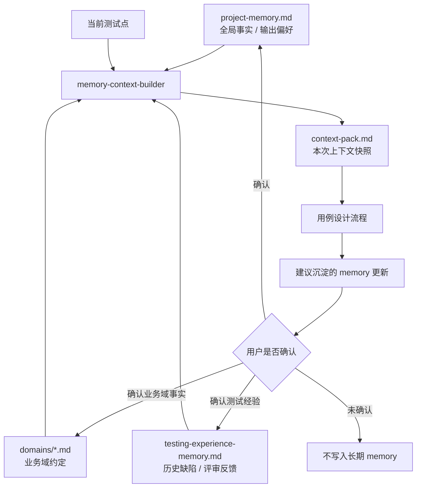
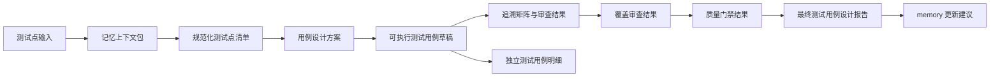
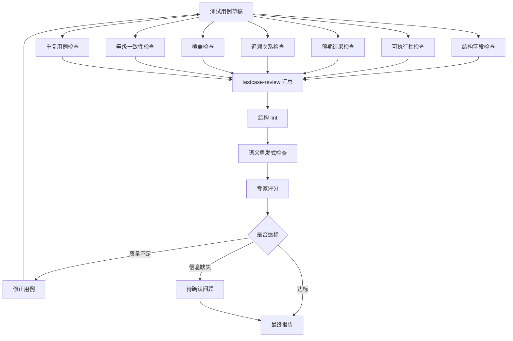
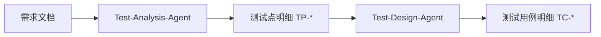

# 测试设计 Agent 整体框架设计

## 1. 文档目的

本文描述 Test-Design-Agent 的系统架构、运行流程、组件职责、输出契约和质量闭环。该 Agent 面向已经分析完成的测试点，目标是模拟测试设计专家的用例设计过程，输出完整、规范、可执行、可评审、可追溯的测试用例，而不是重新分析需求或生成自动化脚本。

Test-Design-Agent 参考 Test-Analysis-Agent 的分层设计：使用 Agent 作为可选协作角色，使用 Skill 承载主流程和设计动作，使用 Knowledge 维护稳定测试设计标准，使用 Memory 注入项目上下文和历史经验，使用 Template 约束输出格式，使用 Quality Gate 和 lint 脚本形成确定性质量闭环。

## 2. 设计目标与边界

### 2.1 目标

- 输入一个或多个测试点，支持 Markdown 表格、列表或结构化文本。
- 对测试点做轻量规范化，保留测试点 ID、模块、类型、等级、需求依据和风险备注等来源信息。
- 将测试点扩展为完整测试用例，至少包含用例名称、用例编号、用例等级、前置步骤、测试步骤和预期结果。
- 保证每条测试用例可独立执行、步骤清晰、预期结果可判定。
- 基于测试点类型、风险等级和场景测试条件推导合适的测试设计方法与用例设计策略，包括正向路径、异常路径、边界数据、状态流转、权限角色、接口契约、数据一致性和组合兼容。
- 维护测试点到测试用例的追溯关系，确保每条有效测试点至少被一个测试用例覆盖。
- 结合 memory 注入项目约定、用例编号规则、角色账号、环境限制、历史缺陷和团队输出偏好。
- 通过质量门禁和确定性 lint 做自我审查，降低不可执行、步骤缺失、预期含糊、编号重复和覆盖遗漏等问题。

### 2.2 非目标

- 不从原始需求直接生成测试点。
- 不替代 Test-Analysis-Agent 的需求分析和测试点分析职责。
- 不生成自动化脚本、测试代码或接口调用程序。
- 不编造需求、业务规则、账号权限、环境地址或测试数据。
- 不输出只有检查目标、没有可执行步骤的“伪用例”。
- 不把测试步骤写成笼统指令，例如“验证功能正常”“检查结果正确”。

## 3. 核心输入与输出

### 3.1 输入

Test-Design-Agent 的推荐输入是测试用例设计输入包，结构为“需求 -> 测试场景 -> 场景测试条件 -> 测试点”，并将接口测试对象拆分为“接口测试清单 -> 接口测试详情 -> 接口测试点”。其中场景测试条件绑定在测试场景上，用于承载场景入口/触发方式、执行用户/角色、前置条件、测试数据因子、业务设计约束和补充说明；接口详情以接口测试点和自由补充说明为主。

输入包模板：

```text
templates/testcase-design-input-template.md
```

输入包示例：

```text
examples/inputs/sample-order-design-input.md
```

兼容输入是测试点明细文件，推荐来自 Test-Analysis-Agent：

```text
outputs/runs/<run-id>/<需求文件名安全短名>.testpoint-details.md
```

输入测试点建议字段：

| 字段 | 说明 |
|---|---|
| ID | 测试点编号，例如 `TP-001` |
| 模块 | 业务模块或功能域 |
| 测试点 | 待验证的目标、场景或风险 |
| 大类 | 测试类型大类，例如功能性、性能、兼容性、易用性、可靠性 |
| 子类 | 测试类型子类，例如功能正确性测试、性能规格测试、容错容灾测试 |
| 需求依据 | 需求标题、段落、规则或明确的来源说明 |
| 风险/备注 | 已知风险、不确定性或评审备注 |

输入包中的测试场景清单使用 `场景测试类型` 表达场景主要关注的测试类型，不要求填写场景等级。测试点不要求填写级别；用例等级由 Test-Design-Agent 在测试设计阶段结合等级规则、风险、业务影响和项目 memory 推导。

若输入缺少关键字段，Agent 应进入澄清或降级策略：能安全补全的字段记录推断依据，不能安全补全的字段写入待确认问题，不得编造业务事实。

### 3.2 输出

主输出是测试用例设计报告，额外输出独立测试用例明细文件。

完整报告路径：

```text
${PROJECT_ROOT}/outputs/runs/<run-id>/<测试点文件名安全短名>.test-cases.md
```

独立明细路径：

```text
${PROJECT_ROOT}/outputs/runs/<run-id>/<测试点文件名安全短名>.testcase-details.md
```

测试用例明细字段：

| 字段 | 必填 | 说明 |
|---|---|---|
| 用例编号 | 是 | 全局唯一，例如 `TC-001`，可按项目 memory 覆盖编号规则 |
| 用例名称 | 是 | 动宾结构，表达被测对象、场景和验证目标 |
| 用例等级 | 是 | `Level 0` 至 `Level 4`，按等级规则、测试点风险、业务影响和项目 memory 综合确定 |
| 前置步骤 | 是 | 执行前必须满足的环境、数据、账号、状态准备 |
| 测试步骤 | 是 | 可顺序执行的操作步骤，编号清晰 |
| 预期结果 | 是 | 与测试步骤逐条一一对应，数量保持一致，必须可观察、可判定 |

测试点关联、覆盖状态和备注在追溯矩阵中表达，不写入单条测试用例明细。

## 4. 架构原则

| 原则 | 说明 |
|---|---|
| 测试点驱动 | 所有测试用例必须从输入测试点或用户补充上下文派生，不能脱离测试点自由扩展 |
| 可执行优先 | 用例必须具备明确前置条件、顺序步骤和可判定预期 |
| 追溯完整 | 通过追溯矩阵关联测试点与测试用例，每个有效测试点至少被一条用例覆盖；允许一条用例覆盖同一场景下共享执行链路的多个测试点 |
| 预期可观察 | 预期结果必须包含界面、接口响应、数据状态、日志、通知、权限结果等可观察对象 |
| 数据显式化 | 测试数据不能隐含在步骤里，关键输入、边界值和账号角色应显式列出 |
| 风险分层 | 高风险测试点优先扩展为更完整的正向、异常、边界和回归用例 |
| 澄清克制 | 只在缺失信息影响可执行性或会导致错误业务假设时提问 |
| 质量闭环 | 生成后必须经过结构、追溯、可执行性、预期可判定性、覆盖和等级校验 |
| 平台可适配 | Claude Code plugin、OpenClaw 或其他执行容器只作为运行载体，核心逻辑沉淀在 Markdown 文件中 |

## 5. 系统上下文视图



系统对外暴露一个稳定能力：基于测试点生成规范测试用例。Agent 协作层是可选的，主流程应由入口 skill 固化，避免 Agent 与 Skill 维护两套流程真相。

## 6. 目录结构设计

```text
test-design-agent/
├── .claude-plugin/
│   └── plugin.json
├── agents/
│   ├── orchestrator.md
│   ├── testcase-design-agent.md
│   └── testcase-review-agent.md
├── skills/
│   ├── design-testcases-from-testpoints/
│   ├── testcase-design/
│   ├── testcase-writing/
│   ├── clarification-gate/
│   ├── memory-context-builder/
│   └── testcase-review/
├── knowledge/
│   ├── basic-test-types.md
│   ├── test-scenario-point-case-boundary.md
│   ├── testcase-standard.md
│   ├── testcase-writing-guide.md
│   ├── testcase-design-patterns/
│   │   ├── README.md
│   │   ├── specification-based/
│   │   │   ├── equivalence-boundary.md
│   │   │   ├── data-combination.md
│   │   │   ├── decision-table.md
│   │   │   ├── decision-point.md
│   │   │   ├── processing-cycle.md
│   │   │   ├── state-transition.md
│   │   │   ├── scenario-usecase-userstory.md
│   │   │   ├── cause-effect.md
│   │   │   └── interface-contract.md
│   │   ├── experience-based/
│   │   │   └── error-guessing-checklist.md
│   │   ├── risk-based/
│   │   │   └── risk-based-test-design.md
│   │   └── quality-attribute-based/
│   │       ├── performance-efficiency.md
│   │       └── reliability-recoverability.md
│   └── coverage-traceability-standard.md
├── memory/
│   ├── README.md
│   ├── project-memory.md
│   ├── domains/
│   │   └── *.md
│   └── testing-experience-memory.md
├── templates/
│   ├── testcase-design-input-template.md
│   ├── testcase-design-plan-template.md
│   ├── testcase-report-template.md
│   ├── testcase-detail-template.md
│   └── clarification-session-template.md
├── quality-gates/
│   ├── testcase-schema-check.md
│   ├── testcase-executability-check.md
│   ├── expected-result-check.md
│   ├── traceability-check.md
│   ├── coverage-check.md
│   ├── level-consistency-check.md
│   ├── duplicate-testcase-check.md
│   └── expert-review-rubric.md
├── bin/
│   ├── lint-testcase-report.py
│   ├── build-memory-context.py
│   ├── run-test-design.py
│   ├── semantic-testcase-check.py
│   └── smoke-test-design.py
├── examples/
└── outputs/
    └── runs/
        └── <run-id>/
            ├── context-pack.md
            ├── clarification-session.md
            ├── <测试点文件名安全短名>.test-cases.md
            └── <测试点文件名安全短名>.testcase-details.md
```

### 6.1 目录职责

| 目录 | 职责 |
|---|---|
| `.claude-plugin/` | Claude Code plugin manifest |
| `agents/` | 可选 subagent 角色定义，用于阶段性专家协作 |
| `skills/` | 主流程和测试设计动作，定义怎么从测试点生成用例 |
| `knowledge/` | 稳定测试类型、测试场景/测试点/测试用例边界、测试用例标准、可执行用例编写准则、设计模式和覆盖追溯标准 |
| `memory/` | 经人工确认的项目事实、业务域约定、历史缺陷和团队输出偏好 |
| `templates/` | 测试用例设计输入包、最终报告、独立用例明细和澄清会话产物格式 |
| `quality-gates/` | Agent 可读的质量门禁规则 |
| `bin/` | 可机械执行的结构 lint、语义启发式检查和 smoke 回归脚本 |
| `examples/` | 示例测试点输入和预期用例输出 |
| `outputs/` | 按 run 保存的运行产物 |

### 6.2 Skill 结构

Skill 按主流程动作组织，覆盖上下文构建、用例设计、用例编写、澄清治理和质量审查。

| 路径 | 职责 | 主要产出 |
|---|---|---|
| `skills/design-testcases-from-testpoints/` | 入口 skill，串联测试点规范化、上下文注入、设计、编写、审查和输出 | 完整测试用例设计报告、独立测试用例明细 |
| `skills/testcase-design/` | 设计测试点到测试用例的转换方案，包括用例数量、类型、等级、覆盖意图和扩展策略 | 用例设计方案 |
| `skills/testcase-writing/` | 编写完整可执行用例，生成用例名称、用例编号、用例等级、前置步骤、测试步骤和预期结果 | 可执行测试用例草稿 |
| `skills/clarification-gate/` | 管理澄清问题，判断是否需要打断用户，合并用户确认信息 | 澄清会话记录、待确认问题 |
| `skills/memory-context-builder/` | 读取项目记忆、业务域记忆和历史测试经验 | 记忆上下文包 |
| `skills/testcase-review/` | 审查用例质量，校验追溯矩阵、覆盖结论、重复项、等级一致性和质量门禁反馈 | 覆盖审查结果、质量门禁结果 |

### 6.3 Knowledge 结构

Knowledge 按稳定知识域组织，供 skill 在运行时按需读取。

| 路径 | 内容范围 | 主要使用方 |
|---|---|---|
| `knowledge/basic-test-types.md` | 基本测试类型定义、说明和质量属性覆盖范围，用于测试点大类/子类识别和覆盖面判断 | `testcase-design` |
| `knowledge/test-scenario-point-case-boundary.md` | 需求、测试场景、场景测试条件、测试点和测试用例的定义、分层关系、粒度边界和示例 | `design-testcases-from-testpoints`、`testcase-design` |
| `knowledge/testcase-standard.md` | 测试用例字段、编号、命名、粒度、等级体系和基础格式 | `testcase-writing`、`testcase-review` |
| `knowledge/testcase-writing-guide.md` | 测试数据、前置条件、操作步骤、预期结果、可观察性和可判定性 | `testcase-writing`、`testcase-review` |
| `knowledge/testcase-design-patterns/` | 测试设计模式库，包含路由索引和各模式详细说明 | `testcase-design` |
| `knowledge/coverage-traceability-standard.md` | 测试点到用例的覆盖关系、追溯矩阵、部分覆盖和未覆盖判定规则 | `testcase-design`、`testcase-review` |

`knowledge/testcase-design-patterns/README.md` 维护测试点信号到设计模式文件的路由关系和读取顺序。具体模式文件维护适用条件、设计步骤、覆盖项识别方式、用例数量控制、常见测试数据、预期结果关注点和反例。

`knowledge/basic-test-types.md` 维护测试类型知识。测试类型用于说明测试点关注的质量属性和验证方向，不等同于测试设计模式；具体用例展开仍由测试设计模式库完成。

`knowledge/test-scenario-point-case-boundary.md` 维护需求、测试场景、场景测试条件、测试点和测试用例之间的层级关系。它用于输入规范化和粒度检查，避免把场景、测试点和用例混写。

运行时路径解析规则：文档、Agent 和 Skill 中出现的 `skills/...`、`knowledge/...`、`templates/...`、`quality-gates/...`、`memory/...`、`bin/...` 和 `outputs/...` 均为仓库根目录相对路径，不是当前 agent、skill 或输入文件目录的相对路径。执行 `testcase-design` 时不得查找 `skills/testcase-design/knowledge/`。

### 6.4 测试设计模式库

测试设计模式库按基于规格的测试、基于经验的测试、基于风险的测试和基于质量属性的测试组织。基于规格的测试负责从功能规则派生用例；基于经验的测试负责补充历史缺陷和专家检查项；基于风险的测试负责确定优先级、覆盖深度和用例等级；基于质量属性的测试负责补充性能效率、可靠性和恢复性验证。

| 分类 | 模式文件 | 适用信号 | 说明 |
|---|---|---|---|
| 基于规格的测试 | `specification-based/equivalence-boundary.md` | 范围、阈值、枚举、格式、数量、金额、时间窗口 | 覆盖等价类划分和边界值分析 |
| 基于规格的测试 | `specification-based/data-combination.md` | 多输入参数、多配置项、多维数据组合、平台/版本/渠道组合 | 对应 DCoT 数据组合测试设计，包含全组合、pairwise、正交和风险裁剪策略 |
| 基于规格的测试 | `specification-based/decision-table.md` | 多条件共同决定结果、业务规则矩阵、条件组合与动作映射 | 对应 DTT 判定表测试设计，每条有效规则可派生一组用例 |
| 基于规格的测试 | `specification-based/decision-point.md` | 流程中的判断节点、单条件或少量条件的分支、校验点、开关点 | 对应 DPT 判定点测试设计，适合不需要展开完整判定表的局部判断 |
| 基于规格的测试 | `specification-based/processing-cycle.md` | 账期、结算周期、批处理周期、重试周期、定时任务、循环处理 | 对应 PCT 处理周期测试设计，关注周期开始/进行中/结束/跨周期/重复处理 |
| 基于规格的测试 | `specification-based/state-transition.md` | 状态、生命周期、审批、取消、重试、超时、回退 | 覆盖合法迁移、非法迁移和关键状态保持 |
| 基于规格的测试 | `specification-based/scenario-usecase-userstory.md` | 主流程、备选流程、用户故事、验收标准、端到端业务链路 | 覆盖场景测试、用例测试和用户故事测试 |
| 基于规格的测试 | `specification-based/cause-effect.md` | 输入原因与输出结果之间存在复杂布尔关系，且需要先建模再落表 | 因果图用于辅助建模，可转化为判定表或数据组合用例 |
| 基于规格的测试 | `specification-based/interface-contract.md` | API、字段、错误码、回调、第三方系统、消息契约 | 属于规格/契约驱动的接口测试设计扩展 |
| 基于经验的测试 | `experience-based/error-guessing-checklist.md` | 历史缺陷、易错规则、专家检查清单、上线事故复盘 | 覆盖错误推测、检查清单和探索式启发 |
| 基于风险的测试 | `risk-based/risk-based-test-design.md` | 资金、安全、合规、不可逆操作、高用户影响、历史高发缺陷 | 决定优先级、覆盖深度、用例等级和高风险补充场景 |
| 基于质量属性的测试 | `quality-attribute-based/performance-efficiency.md`、`quality-attribute-based/reliability-recoverability.md` | 性能效率、可靠性、恢复性等非功能关注点 | 补充可执行验证场景和可观察预期 |

“正向/异常”作为各模式的路径属性处理，在具体模式文件的用例选择规则中体现。权限、角色、租户、数据一致性、缓存、库存、审计等业务关注点作为测试点信号进入路由，再映射到基于规格的测试、基于风险的测试或基于质量属性的测试。

### 6.5 Template 结构

| 路径 | 内容范围 | 输出场景 |
|---|---|---|
| `templates/testcase-design-input-template.md` | 测试用例设计输入包，包含需求信息、测试场景清单、测试场景详情、接口测试清单、接口测试详情、待确认信息和输入完整性自检；测试场景承载页面、业务流程、资料、性能、可靠性等对象，场景测试条件承载入口、用户/角色、前置条件、测试数据因子、业务设计约束和自由补充说明，接口测试对象承载接口契约、字段、错误码、幂等和鉴权等对象 | 输入准备、评审前补充上下文 |
| `templates/testcase-design-plan-template.md` | 测试用例设计方案中间产物，统一 `testcase-design` 到 `testcase-writing` 的字段契约 | 设计阶段、编写阶段输入 |
| `templates/testcase-report-template.md` | 完整测试用例设计报告，包含设计范围、输入摘要、澄清摘要、用例设计方案、用例明细、追溯矩阵、覆盖审查、质量门禁、专家评分、待确认问题和 memory 更新建议 | 默认交付报告 |
| `templates/testcase-detail-template.md` | 独立测试用例明细，只包含用例编号、用例名称、用例等级、前置步骤、测试步骤和预期结果 | 用例平台导入、专项评审 |
| `templates/clarification-session-template.md` | 澄清问题、用户回答、未解决问题和上下文合并结果 | 澄清会话记录 |

## 7. 分层架构



### 7.1 分层边界

| 层 | 放什么 | 不放什么 |
|---|---|---|
| Agent | 阶段性协作角色和任务拆分说明 | 另一套主流程真相 |
| Skill | 触发条件、输入、执行步骤、输出要求、质量检查顺序 | 长篇理论定义和项目事实 |
| Knowledge | 通用测试设计标准、可执行用例编写准则、设计模式、覆盖追溯标准 | 单次运行结果、检查门禁和未确认业务规则 |
| Memory | 经确认的项目事实、业务域约定、历史缺陷、用例偏好 | 通用测试理论和临时推断 |
| Template | 需要落盘或独立复用的 Markdown 结构、字段、示例占位 | 普通报告章节、执行流程和质量判定逻辑 |
| Quality Gate | 通过/失败条件、字段校验和语义检查规则 | 新业务规则或新测试理论 |
| bin | 可机械执行的结构、语义和回归检查 | 不可解释的专家判断 |

## 8. 主运行流程



### 8.1 流程说明

1. 固定当前会话工作目录为 `PROJECT_ROOT`，创建独立运行目录 `${PROJECT_ROOT}/outputs/runs/<run-id>/`；可使用 `bin/run-test-design.py <输入文件>` 准备运行目录、初始模板和上下文包。
2. 使用 `memory-context-builder` 或 `bin/build-memory-context.py` 筛选本次相关项目上下文，生成 `context-pack.md`。
3. 在主入口 `design-testcases-from-testpoints` 内完成输入规范化：识别测试点字段、保留来源编号、检查明显缺口和重复项。
4. 对缺失字段、编号重复、测试点含义不清、业务约束缺失执行澄清检查。
5. 使用 `testcase-design` 为每条测试点制定用例设计方案，判断需要生成的用例数量、类型、等级、覆盖意图和扩展策略。
6. 使用 `testcase-writing` 编写完整可执行用例，一次性生成用例名称、用例编号、用例等级、前置步骤、测试步骤和预期结果，保证操作与判定不脱节。
7. 使用 `testcase-review` 生成或校验测试点到用例的追溯矩阵，并审查覆盖、重复、等级和可执行性问题。
8. 执行结构 lint、语义启发式检查和质量门禁。
9. 输出完整报告、独立明细和建议沉淀的 memory 更新。

## 9. 可选 Agent 协作流程



可选 Agent 只负责阶段性工作，必须服从主入口 skill 的运行目录、澄清、输出契约和质量门禁规则。

## 10. 测试点到用例的设计策略

### 10.1 策略路由矩阵

| 测试点信号 | 设计模式 | 常见输出 |
|---|---|---|
| 主流程、备选流程、用户故事、验收标准 | `specification-based/scenario-usecase-userstory.md` | 主路径、备选路径、端到端业务链路用例 |
| 阈值、范围、数量、时间窗口、金额 | `specification-based/equivalence-boundary.md` | 有效等价类、无效等价类、边界值和临界值用例 |
| 多输入参数、多配置项、多维数据组合 | `specification-based/data-combination.md` | 全组合、pairwise、正交组合和高风险组合用例 |
| 多条件共同决定结果、业务规则矩阵 | `specification-based/decision-table.md` | 条件组合、互斥条件、缺省规则和冲突规则用例 |
| 单个判断节点、校验点、流程分支、开关点 | `specification-based/decision-point.md` | 判定为真/假、通过/拒绝、默认分支和异常分支用例 |
| 账期、结算周期、批处理周期、重试周期、定时任务 | `specification-based/processing-cycle.md` | 周期开始、周期中、周期结束、跨周期、重复处理和补偿用例 |
| 状态、审批、取消、重试、超时 | `specification-based/state-transition.md` | 合法迁移、非法迁移、状态回退和状态保持用例 |
| 输入原因与输出结果需要先建模再落规则 | `specification-based/cause-effect.md` | 因果关系模型、派生判定表和关键原因组合用例 |
| API、字段、错误码、回调、外部系统 | `specification-based/interface-contract.md` | 请求响应、字段校验、错误码、幂等和回调用例 |
| 历史缺陷、易错规则、上线事故、专家检查清单 | `experience-based/error-guessing-checklist.md` | 高风险回归、异常保护、易错点专项用例 |
| 资金、安全、合规、不可逆操作、高用户影响 | `risk-based/risk-based-test-design.md` | 高优先级主链路、关键异常、回归、防护和审计用例 |
| 性能、容量、响应时间、吞吐量 | `quality-attribute-based/performance-efficiency.md` | 性能效率验证用例 |
| 稳定性、容错、恢复、重试、降级 | `quality-attribute-based/reliability-recoverability.md` | 可靠性和恢复性验证用例 |
| 角色、租户、数据归属、授权 | `specification-based/decision-table.md` 或 `specification-based/decision-point.md` | 有权访问、无权访问、越权拦截和数据隔离用例 |
| 库存、缓存、统计、导出、异步同步 | `specification-based/scenario-usecase-userstory.md`、`specification-based/interface-contract.md`、`specification-based/state-transition.md` 或 `specification-based/processing-cycle.md` | 前后台一致、异步最终一致、失败补偿和审计用例 |

### 10.2 用例数量控制

| 用例等级 | 默认扩展策略 |
|---|---|
| Level 0 | 核心用例，覆盖每个转测试版本必须验证的核心功能，必要时补充关键异常、边界或防护场景 |
| Level 1 | 关键用例，覆盖特性关键功能和关键可靠性，建议每个迭代验证 |
| Level 2 | 重要用例，覆盖系统重要功能，适合 TR 点或对外发布版本进行完整验证 |
| Level 3 | 一般用例，用于较完整的版本全量测试，按变更范围选择相关用例回归 |
| Level 4 | 生僻用例，覆盖低频应用场景和特殊预置条件，建议新特性首次验证后按需回归 |

等级映射最终以 `knowledge/testcase-standard.md` 中的等级规则和项目 memory 为准。

## 11. Memory 设计

### 11.1 Memory 内容边界

Memory 用于保存经人工确认、会影响后续用例设计的项目上下文。

可写入 memory：

- 项目用例编号规则、等级规则和输出偏好。
- 常用测试账号、角色、权限边界和数据归属约定。
- 业务域术语、核心对象、状态机和流程约束。
- 环境、渠道、版本、配置开关和外部系统约定。
- 历史缺陷、回归重点、常见遗漏和评审反馈。

不写入 memory：

- 通用测试设计理论。
- 未确认的业务规则。
- 单次运行产生的完整测试用例。
- 临时推断、猜测或为了补齐步骤而假设的内容。

### 11.2 Memory 使用流程



运行过程中只读取当前 run 的 `context-pack.md`，避免把长期 memory 全量注入每个设计步骤。

## 12. 数据与产物流



### 12.1 中间产物

| 产物 | 来源 | 作用 |
|---|---|---|
| 记忆上下文包 | `memory-context-builder` | 注入本次相关项目事实和测试经验 |
| 规范化测试点清单 | `design-testcases-from-testpoints` | 整理测试点字段，保留来源编号，识别缺口和重复项 |
| 用例设计方案 | `testcase-design` | 决定每条测试点扩展成哪些用例，包含主模式、辅助模式、覆盖意图、标题建议、等级、前置关注、步骤关注、预期关注和待确认信息 |
| 可执行测试用例草稿 | `testcase-writing` | 生成用例名称、用例编号、用例等级、前置步骤、测试步骤和预期结果 |
| 追溯矩阵与审查结果 | `testcase-review` | 证明测试点覆盖完整，并发现遗漏、冗余、等级不一致和不可执行问题 |
| 质量门禁结果 | `quality-gates/` 和 `bin/` | 形成发布前质量结论 |

## 13. 组件职责

### 13.1 Agents

| Agent | 职责 |
|---|---|
| `test-design-orchestrator` | 可选端到端编排代理，串联输入规范化、设计、评审和质量门禁 |
| `testcase-design-agent` | 基于测试点、上下文和设计策略生成测试用例 |
| `testcase-review-agent` | 审查用例可执行性、预期可判定性、覆盖和追溯 |

### 13.2 Skills

| 类型 | Skill |
|---|---|
| 主入口 | `design-testcases-from-testpoints` |
| 用例设计 | `testcase-design` |
| 用例编写 | `testcase-writing` |
| 澄清治理 | `clarification-gate` |
| 记忆注入 | `memory-context-builder` |
| 追溯与质量审查 | `testcase-review` |

### 13.3 Knowledge

| 文件 | 作用 |
|---|---|
| `basic-test-types.md` | 基本测试类型定义、说明和质量属性覆盖范围，用于测试点大类/子类识别和覆盖面判断 |
| `test-scenario-point-case-boundary.md` | 需求、测试场景、场景测试条件、测试点和测试用例的分层关系、粒度边界和示例 |
| `testcase-standard.md` | 测试用例字段、编号、命名、粒度、等级体系和基础格式标准 |
| `testcase-writing-guide.md` | 测试数据、前置步骤、测试步骤、预期结果、可观察性和可判定性编写准则 |
| `testcase-design-patterns/` | 测试用例设计模式目录，包含路由索引和各类模式的详细说明 |
| `coverage-traceability-standard.md` | 测试点到用例的覆盖、追溯、部分覆盖和未覆盖判定规则 |

### 13.4 Templates

| 文件 | 作用 |
|---|---|
| `testcase-design-input-template.md` | 测试用例设计输入包模板 |
| `testcase-report-template.md` | 完整测试用例设计报告模板 |
| `testcase-detail-template.md` | 独立测试用例明细模板 |
| `clarification-session-template.md` | 澄清问题、用户回答、未解决问题和上下文合并结果模板 |

## 14. 输出契约

### 14.1 完整报告结构

```markdown
# <测试点来源名称> 测试用例设计报告

## 1. 设计范围
## 2. 记忆上下文包摘要
## 3. 测试点输入摘要
## 4. 交互澄清摘要
## 5. 用例设计策略
## 6. 测试用例明细
## 7. 测试点到用例追溯矩阵
## 8. 覆盖审查结果
## 9. 质量门禁结果
## 10. 待确认问题
## 11. 专家评审评分
## 12. 建议沉淀的记忆更新
```

### 14.2 测试用例明细格式

推荐使用块状结构，避免 Markdown 表格承载长步骤导致可读性下降。

```markdown
### TC-001 <用例名称>

- 用例编号：TC-001
- 用例名称：验证已登录普通用户在有效输入下成功提交订单
- 用例等级：Level 0
- 前置步骤：
  1. 用户 user_a 已完成注册并处于正常状态。
  2. 系统存在库存大于 1 的普通商品。
  3. 用户已配置有效收货地址。
- 测试步骤：
  1. 使用 user_a 登录系统。
  2. 进入商品详情页，选择目标商品。
  3. 点击立即购买并进入订单确认页。
  4. 确认收货地址和商品金额后提交订单。
- 预期结果：
  1. 登录成功，系统展示 user_a 的登录态。
  2. 商品详情页展示目标商品且库存可购买。
  3. 订单确认页展示的商品、收货地址和金额与选择内容一致。
  4. 订单提交成功，系统生成订单号，订单状态为待支付。
```

### 14.3 追溯矩阵格式

| 测试点 ID | 测试点摘要 | 覆盖用例 | 覆盖状态 | 备注 |
|---|---|---|---|---|
| TP-001 | 验证普通用户提交订单主流程 | TC-001 | 已覆盖 |  |
| TP-002 | 验证库存不足时提交失败 | TC-002 | 已覆盖 |  |

覆盖状态取值：

- `已覆盖`：已有至少一条可执行用例覆盖。
- `部分覆盖`：只覆盖了部分条件、步骤或预期。
- `待确认`：缺少必要业务信息，暂不能生成可靠用例。
- `未覆盖`：质量门禁发现遗漏，必须修正或说明原因。

## 15. 质量闭环



### 15.1 质量门禁

| 门禁 | 检查重点 |
|---|---|
| `testcase-schema-check.md` | 用例编号、名称、等级、前置步骤、测试步骤、预期结果是否齐全 |
| `testcase-executability-check.md` | 步骤是否可执行，是否缺少账号、数据、入口、状态或操作对象 |
| `expected-result-check.md` | 预期是否可观察、可判定，是否和步骤对应 |
| `traceability-check.md` | 追溯矩阵是否建立测试点与测试用例的关联，每个有效测试点是否被覆盖 |
| `coverage-check.md` | 高风险测试点是否覆盖主路径、异常、边界、权限或数据风险 |
| `level-consistency-check.md` | 用例等级是否与测试点风险、业务影响和 memory 规则一致 |
| `duplicate-testcase-check.md` | 是否存在重复、近似重复或只改名称不改验证目标的用例 |
| `bin/build-memory-context.py` | 机械生成 `context-pack.md` 初稿，枚举并匹配本地 `memory/domains/*.md` |
| `bin/run-test-design.py` | 准备 run 目录、上下文包、澄清记录、设计方案和报告/明细初始文件，并可对已生成产物执行检查 |
| `bin/lint-testcase-report.py` | 机械检查报告结构、编号格式、必填字段、追溯矩阵、源测试点覆盖和质量门禁结果 |
| `bin/semantic-testcase-check.py` | 启发式检查步骤空泛、预期含糊、数据缺失和覆盖异常 |
| `bin/smoke-test-design.py` | 对示例测试点执行回归验证 |

### 15.2 失败处理

- 因输出质量失败：修正用例并重新执行质量门禁。
- 因测试点信息缺失失败：生成待确认问题，保留无法可靠设计的测试点，不编造用例。
- 因 memory 冲突失败：记录冲突来源，优先询问用户或采用当前输入中的显式事实。
- 因编号或格式失败：自动修复后重跑 lint。

## 16. 澄清治理

### 16.1 需要澄清的典型情况

- 测试点没有明确被测对象或业务场景。
- 生成可执行步骤必须知道账号、角色、入口、初始状态或数据约束，但输入和 memory 都未提供。
- 测试点包含“按规则处理”“校验通过”等描述，但规则内容缺失。
- 同一测试点存在互相冲突的需求依据或 memory 约定。
- 高风险用例的预期结果无法可靠判定。

### 16.2 不需要打断的情况

- 可使用中性占位表达且不影响用例结构，例如“准备一个满足条件的有效用户”。
- 缺少低风险补充字段，但不影响主步骤和预期。
- 可在待确认问题或追溯矩阵备注中清晰标注待项目替换的信息。

### 16.3 待确认问题输出要求

最终报告中的待确认问题只保留未解决项，已被用户回答、已被 memory 覆盖或重复的问题必须删除。每个问题应包含影响范围、阻塞等级和建议提问。

## 17. 用例等级规则

默认等级定义：

| 用例等级 | 定位 | 执行建议 | 失败影响 |
|---|---|---|---|
| Level 0 | 核心。最核心的功能用例 | 建议每个转测试的版本都验证 | 执行失败意味着版本核心功能受损，没有继续验证的价值 |
| Level 1 | 关键。涉及系统特性的关键功能、关键可靠性等内容的用例 | 建议每个迭代验证 | 执行失败即特性内某个关键功能点测试出现阻塞问题 |
| Level 2 | 重要。覆盖系统所有重要功能的用例 | 建议 TR 点或对外发布版本进行完整验证 | 执行失败表示系统重要功能未正常实现 |
| Level 3 | 一般。版本全量测试较为完整的测试用例 | 建议版本变更较大、需要全量验证覆盖时，根据版本修改点涉及范围，选择变更较大的特性相关部分或全部用例作为回归范围 | 执行失败表示相关一般功能或回归范围存在问题 |
| Level 4 | 生僻。对于较生僻的应用场景和预置条件，是版本不常用场景的用例 | 建议新特性首次验证使用；验证通过后，大多数情况不需要回归执行 | 执行失败表示低频场景或特殊预置条件存在问题 |

若项目 memory 定义了等级体系，应优先使用项目体系，并在报告中说明映射关系。

## 18. 验收标准

- 输入测试点后，能输出完整测试用例设计报告和独立测试用例明细。
- 每条测试用例至少包含用例名称、用例编号、用例等级、前置步骤、测试步骤和预期结果。
- 每条测试用例都能通过追溯矩阵关联至少一个测试点。
- 每个有效测试点至少被一条测试用例覆盖，未覆盖项必须有原因。
- 用例名称能体现被测对象、场景和验证目标。
- 前置步骤能准备执行所需账号、数据、环境和状态。
- 测试步骤按执行顺序排列，操作对象明确，不使用空泛描述。
- 预期结果与测试步骤逐条一一对应，且可观察、可判定。
- 用例等级与测试点风险、业务影响和项目规则一致。
- 高风险测试点能够体现主路径、异常、边界、权限、接口或数据一致性等必要扩展。
- 报告包含测试点到用例追溯矩阵。
- 报告包含覆盖审查结果、质量门禁结果、专家评审评分和待确认问题。
- 示例报告可通过 `bin/lint-testcase-report.py <报告路径> --source <输入路径>`、`bin/semantic-testcase-check.py` 和 `bin/smoke-test-design.py`。

## 19. 版本范围

- v1 输入以单个 Markdown 测试点文件为主，也支持用户直接粘贴测试点文本。
- v1 输出 Markdown 测试用例，不输出 Excel、TestLink、禅道或 Xray 等平台格式；后续可通过导出适配器扩展。
- v1 memory 使用 Markdown 文件维护，memory 更新需要人工确认。
- v1 优先适配 Claude Code plugin / skills / subagents。
- OpenClaw 兼容通过后续适配层实现，不重写核心架构。
- 若输入测试点来自 Test-Analysis-Agent，应优先复用其 `TP-*` 编号和测试点等级。

## 20. 与 Test-Analysis-Agent 的关系

Test-Analysis-Agent 和 Test-Design-Agent 的职责边界如下：

| 阶段 | Agent | 输入 | 输出 | 核心约束 |
|---|---|---|---|---|
| 测试分析 | Test-Analysis-Agent | 需求文档 | 测试点分析报告、测试点明细 | 不生成测试用例 |
| 测试设计 | Test-Design-Agent | 测试点 | 测试用例设计报告、测试用例明细 | 必须生成可执行测试用例 |

推荐链路：



Test-Design-Agent 不重新争夺需求分析职责，只在测试点信息不足以生成可执行用例时，提出澄清问题或标记待确认风险。
